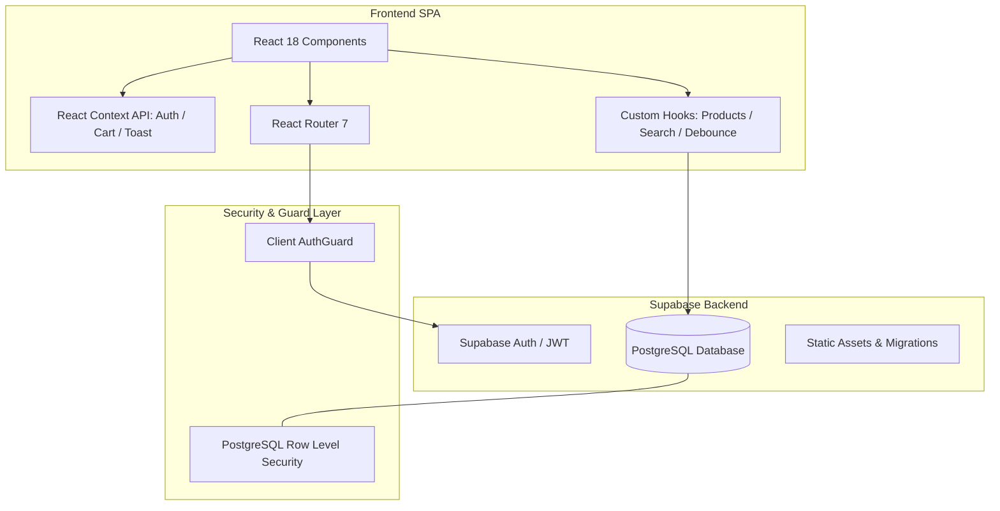

# 🛍️ ShopSphere — Enterprise Full-Stack E-Commerce Platform

[](https://react.dev/)
[](https://www.typescriptlang.org/)
[](https://supabase.com/)
[](https://tailwindcss.com/)
[](https://vitejs.dev/)

ShopSphere is a high-performance, modular full-stack e-commerce web platform engineered with **React 18**, **TypeScript**, **Supabase (PostgreSQL)**, and **Tailwind CSS**. It combines a friction-free consumer storefront with an administrative business intelligence suite.

---

## 📌 Architectural Overview

ShopSphere is designed with scalable component boundaries, centralized state management, and strict type safety across the entire application lifecycle:



---

## 🚀 Key Modules & Capabilities

### 🛍️ 1. Consumer Storefront Experience
- **Smart Catalog Navigation:** Dynamic multi-category browsing, real-time debounced keyword search, and granular price/rating filters.
- **Product Presentation:** High-resolution product image carousels, instant stock status indicators, customer reviews, and star rating analytics.
- **Interactive Shopping Cart:** Real-time quantity adjustments, price calculations, free shipping progress indicators, and local storage state hydration.
- **Streamlined Checkout:** Guided multi-step checkout workflow with customer shipping details, order preview, and instant confirmation.
- **Customer Account Management:** User authentication (Email/Password), order tracking with status milestones (`Pending` → `Processing` → `Shipped` → `Delivered`), and personalized wishlists.

### 📊 2. Operations & Admin Management Suite
- **Business Intelligence Dashboard:** 7-day interactive revenue trajectory charts (Recharts), order fulfillment status breakdown, KPI summary cards, and inventory low-stock alerts.
- **Catalog & Inventory Control:** Complete CRUD product management, category taxonomy ordering, pagination, and bulk inventory actions.
- **Order Processing Hub:** End-to-end order status management, inline shipping tracking ID entry, and CSV order data export.
- **Customer CRM Directory:** Customer account inspector, order purchase history aggregation, and role permission control.
- **Audit & Activity Log:** Real-time log capturing user registrations, incoming purchases, and submitted product reviews.

---

## ⚙️ Engineering & Technical Highlights

- **End-to-End Type Safety:** Strict TypeScript models for all database entities, props, state payloads, and API contracts.
- **Database-Level Access Control (RLS):** Supabase Row Level Security ensures users can only read and mutate their own data records.
- **Optimized Bundle Splitting:** Route-level dynamic code-splitting using `React.lazy()` and `Suspense` for near-instant Initial Server Response (TTFB) and fast First Contentful Paint (FCP).
- **Resilient UI Architecture:** Comprehensive `ErrorBoundary` fail-safes and animated loading skeletons for smooth user transitions.
- **Custom Design System:** Responsive, utility-first design built with custom Tailwind CSS design tokens and micro-interactions.

---

## 🛠️ Technology Matrix

| Domain | Technology | Purpose |
|:---|:---|:---|
| **Core Frontend** | React 18, Vite 5 | Fast component rendering, rapid HMR development |
| **Language** | TypeScript 5.5 | Compile-time safety and strict interface definitions |
| **Routing** | React Router 7 | Declarative nested routing and route protection |
| **Styling & UI** | Tailwind CSS 3.4, Lucide Icons | Responsive UI design and clean visual iconography |
| **Analytics & Charts** | Recharts 3 | Responsive SVG data visualization for store metrics |
| **Database & Auth** | Supabase, PostgreSQL | Relational data integrity, JWT authentication, RLS |
| **Tooling & Linter** | ESLint 9, PostCSS, Autoprefixer | Code quality enforcement and asset compilation |

---

## 💻 Local Setup & Installation

### Prerequisites
- **Node.js** (v18.0.0 or higher)
- **npm** (v9.0.0 or higher)

### 1. Clone the Repository
```bash
git clone https://github.com/Ankitagmallesh/full-stack-ecommerce-platform.git
cd full-stack-ecommerce-platform
```

### 2. Install Dependencies
```bash
npm install
```

### 3. Configure Environment Variables
Create a `.env` file in the root directory:
```env
VITE_SUPABASE_URL=your_supabase_project_url
VITE_SUPABASE_ANON_KEY=your_supabase_anon_key
```

### 4. Start Development Server
```bash
npm run dev
```

---

## 📁 Repository Organization

```
full-stack-ecommerce-platform/
├── public/                 # Static assets, icons, and robots.txt
├── src/
│   ├── components/         # Modular reusable UI components
│   │   ├── layout/         # Navigation, Footers, AuthGuards
│   │   ├── product/        # Product cards, grids, and display blocks
│   │   └── ui/             # Modals, Skeletons, Spinners, Toast alerts
│   ├── context/            # Context API providers (Auth, Cart, Toast)
│   ├── hooks/              # Reusable React hooks (useProducts, useDebounce)
│   ├── lib/                # Supabase client, constants, and utilities
│   ├── pages/              # Application views and storefront routes
│   │   └── admin/          # Admin dashboard, products, orders, activity
│   └── types/              # TypeScript interface definitions
├── supabase/               # SQL schema migrations and seed datasets
├── package.json            # Dependencies and scripts
└── vite.config.ts          # Vite build configuration
```

---

## 👩‍💻 Author

**Ankita G Mallesh**
- GitHub: [@Ankitagmallesh](https://github.com/Ankitagmallesh)
- Project: [Fullstack E-Commerce Platform](https://github.com/Ankitagmallesh/full-stack-ecommerce-platform)
